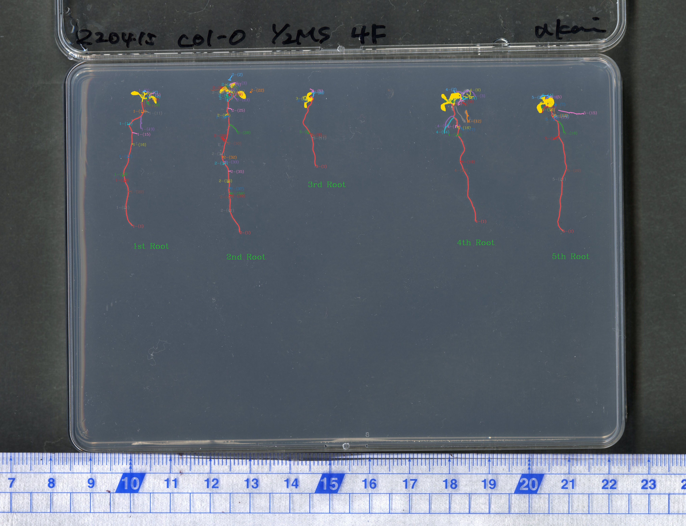

# RAPID

An updated version of the RootMeasurement tool.

## Current segmentation pipeline

The legacy Keras/TensorFlow U-Net path has been removed because in the current stage the U-Net behaves poor. 
RAPID now uses:

- YOLO for ROI detection (`best.pt`)
- `ICWAPR` is the method presented in ICWAPR 2023 in Japan. 
- `Journal` is the method described in journal. (under review)

## Recommended Windows/ubuntu environment

RAPID is configured for Python 3.10.20.

### Create from `environment.yml`

```bat
conda env create -f environment.yml
conda activate rapid
python Application.py
```

### Or create the environment manually

```bat
conda create -n rapid python=3.10.20 -y
conda activate rapid
python -m pip install --upgrade pip setuptools wheel
python -m pip install --no-cache-dir -r requirements.txt
python Application.py
```
Here is an example of the process images.
<p align="center">
  
</p>
If you get error related to "UnicodeDecodeError: 'utf-8' codec can't decode byte 0x8c in position 160: invalid start byte", just remove temp foloder and make a new one.

If an older `rapid` environment contains incompatible NumPy/scikit-image binaries, recreating the environment is recommended instead of installing over the old environment.
